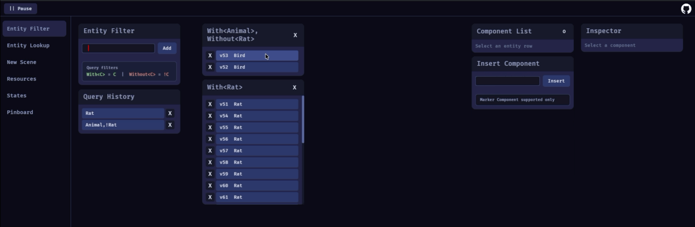

# Bevy Pin

[](https://github.com/rockcen9/bevy_pin#license)

> **Inspect Bevy, Built with Bevy. 🕊️**

Bevy Pin is a remote debugging and data inspection tool for Bevy, running in the browser and communicating via the official Bevy Remote Protocol.

- 📌 **Pin Data:** Keep essential information pinned in view for streamlined debugging.
- 📦 **Zero External Dependencies:** Built natively, no third-party crates needed in your game project!
- 🔌 **Powered by BRP:** Built on top of Bevy’s remote protocol.

[**🎮 Try it live here!**](https://rockcen9.github.io/bevy_pin/)



*The default connection is `127.0.0.1:15702`. To connect to a custom address, append `?host=192.168.1.100:15702` to the URL.*
*Example Bevy setup is available in [`./examples/demo_game.rs`](./examples/demo_game.rs).*

> [!WARNING]
> This project is currently under active development. Features are subject to change.

### Native Alternative

If you prefer a native desktop app over the web dashboard, clone this repository and run:

```bash
cargo run
```

*It will keep trying to connect to `http://127.0.0.1:15702` by default.*

## [Changelog](./CHANGELOG.md)

### [0.1.17] - 2026-04-15

- feat: feat: display entity descendant hierarchy

### [0.1.14] - 2026-04-14

- update new scene and entity lookup for the new explorer card

## Features

- **Entity Filter**: Track specific entities and their component changes using `With<T>`/`Without<T>` or shorthand `T`/`!T`.
- **State Monitor**: Easily switch between app states or trigger a `NextState`.
- **Resource Monitor**: Watch and edit resource values in real-time.

## Setup & Usage

Enable the `bevy_remote` feature in your `Cargo.toml`:

```toml
bevy = { workspace = true, features = ["bevy_remote"] }
```

Add the remote plugins with CORS headers, and register your types for reflection:

```rust
let cors_headers = Headers::new()
    .insert("Access-Control-Allow-Origin", "https://rockcen9.github.io/bevy_pin/")
    .insert("Access-Control-Allow-Headers", "Content-Type");

app.add_plugins(RemotePlugin::default())
   .add_plugins(RemoteHttpPlugin::default().with_headers(cors_headers));

// Register States
app.init_state::<Screen>()
   .register_type::<State<Screen>>()
   .register_type::<NextState<Screen>>();

// Register Resources
#[derive(Resource, Reflect)]
#[reflect(Resource)]
pub struct House { /* ... */ }
app.init_resource::<House>();

// Register Components
#[derive(Component, Reflect)]
#[reflect(Component)]
pub struct Bird { /* ... */ }
```

## Roadmap

- [x] view component data
- [x] edit component data
- [x] pick from query history
- [x] spawn new scene
- [x] add components to entities
- [x] pin entity info to the pinboard
- [x] switch to a tree style view for components list
- [ ] parent and child entity view support
- [ ] make the pin the entities, components, states, and resources to pinboard
- [ ] remove children and child of components
- [ ] highlight data fields whenever a value changes
- [ ] improve the ui design
- [ ] Debug observers

## Compatible Versions

Compatible with Bevy versions without BRP breaking changes:

| Bevy version | `bevy_pin` version |
|:-------------|:-------------------|
| `0.19 dev`   | `0.1`              |

## License

- [MIT License](./LICENSE-MIT.md)
- [Apache License, Version 2.0](./LICENSE-APACHE-2.0.md)

## Credits

- [bevy-inspector-egui](https://github.com/jakobhellermann/bevy-inspector-egui) - A huge inspiration for Bevy inspector tools.

- [Flecs Explorer](https://www.flecs.dev/explorer/) - Real-time ECS data visualization and debugging.

- [bevy_cli](https://github.com/theBevyFlock/bevy_cli) -  Significantly simplifies the WebAssembly build workflow.
