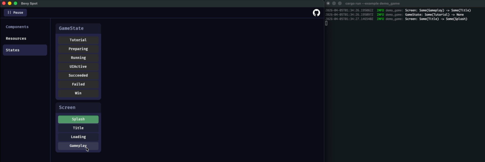
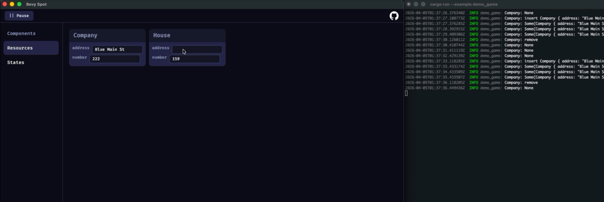
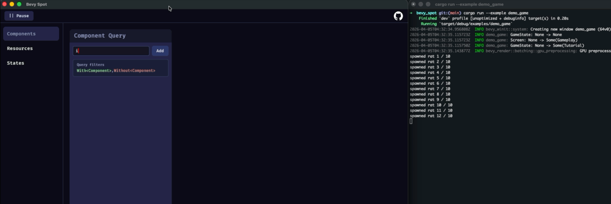

# Bevy Pin

### Inspect Bevy, Built with Bevy. 🕊️

- Pin Data: Keep essential information in view for streamlined debugging.
- Zero External Dependencies: Use it directly without adding any third-party crates to your project.
- Official Integration: Fully compatible with the official Bevy Remote Protocol.
  
Example setup in [./examples/demo_game.rs](./examples/demo_game.rs)

Try it live at <https://rockcen9.github.io/bevy_pin/>!
The default host is `127.0.0.1:15702`.
You can append `?host=192.168.1.100:15702` to the URL to connect to a completely different address.

> [!WARNING]
> This project is currently under active development. Features are subject to change.

### Native Alternative

Run `cargo run` from the project directory. By default, it will keep trying to connect to <http://127.0.0.1:15702>.

## [Changelog](./CHANGELOG.md)

### [0.1.3] - 2026-04-07

- Update component data

### [0.1.2] - 2026-04-06

- Component data inspector (Read Only)

## Features

- **Entity Query**: Track specific entities and their component changes using `With<T>`/`Without<T>` or shorthand `T`/`!T`.
- **State Monitor**: Easily switch between app states or trigger a `NextState`.
- **Resource Monitor**: Watch and edit resource values in real-time.

## Setup & Usage

Enable the `bevy_remote` feature in your `Cargo.toml`:

```toml
bevy = { workspace = true, features = ["bevy_remote"] }
```

Add the remote plugins with CORS headers, and register your types for reflection:

```rust
let cors_headers = Headers::new()
    .insert("Access-Control-Allow-Origin", "https://rockcen9.github.io/bevy_pin/")
    .insert("Access-Control-Allow-Headers", "Content-Type");

app.add_plugins(RemotePlugin::default())
   .add_plugins(RemoteHttpPlugin::default().with_headers(cors_headers));

// Register States
app.init_state::<Screen>()
   .register_type::<State<Screen>>()
   .register_type::<NextState<Screen>>();

// Register Resources
#[derive(Resource, Reflect)]
#[reflect(Resource)]
pub struct House { /* ... */ }
app.init_resource::<House>();

// Register Components
#[derive(Component, Reflect)]
#[reflect(Component)]
pub struct Bird { /* ... */ }
```

## Demos

<p align="center">
  
  
  
</p>

## Roadmap

- [x] View component data
- [x] Edit component data
- [ ] Pick from query history
- [ ] Add components to entities
- [ ] Pin Entity by ID
- [ ] Cache query history for the browser
- [ ] Debug observers

## Compatible Versions

Compatible with Bevy versions without BRP breaking changes:

| Bevy version | `bevy_pin` version |
|:-------------|:-------------------|
| `0.19 dev`   | `0.1`              |

## License

- [MIT License](./LICENSE-MIT.md)
- [Apache License, Version 2.0](./LICENSE-APACHE-2.0.md)

## Credits

- [bevy-inspector-egui](https://github.com/jakobhellermann/bevy-inspector-egui) - A huge inspiration for Bevy inspector tools.

- [Flecs Explorer](https://www.flecs.dev/explorer/) - Real-time ECS data visualization and debugging.

- [bevy_cli](https://github.com/theBevyFlock/bevy_cli) -  Significantly simplifies the WebAssembly build workflow.
